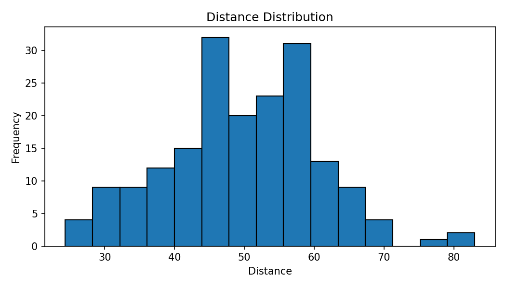
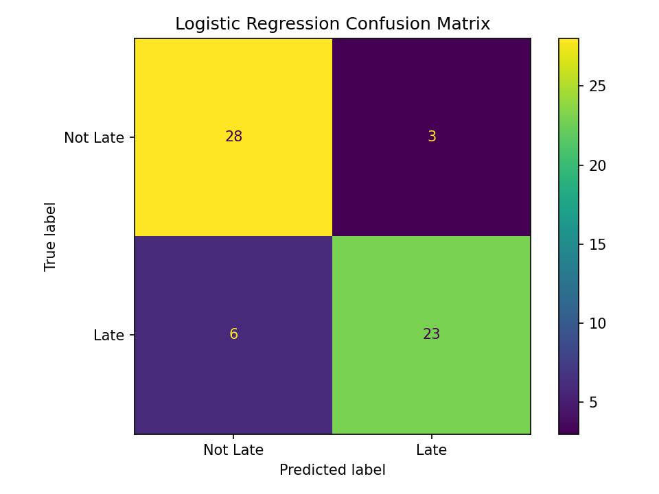
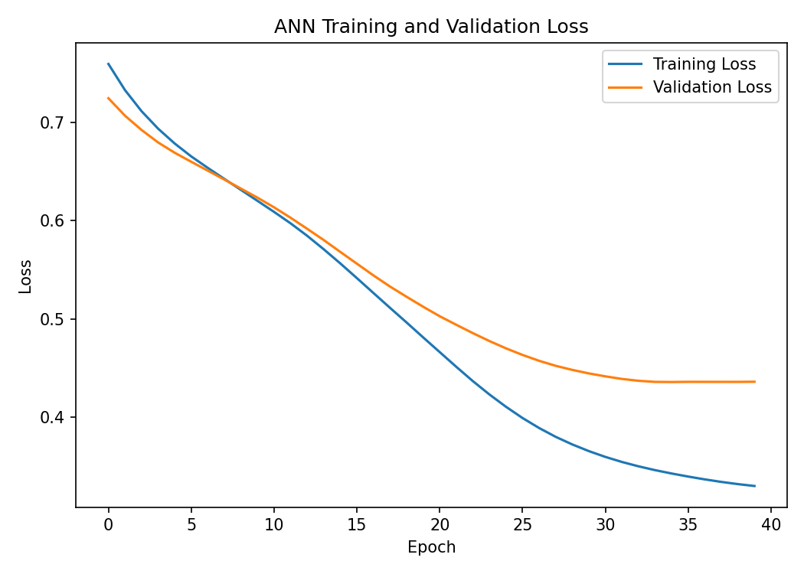
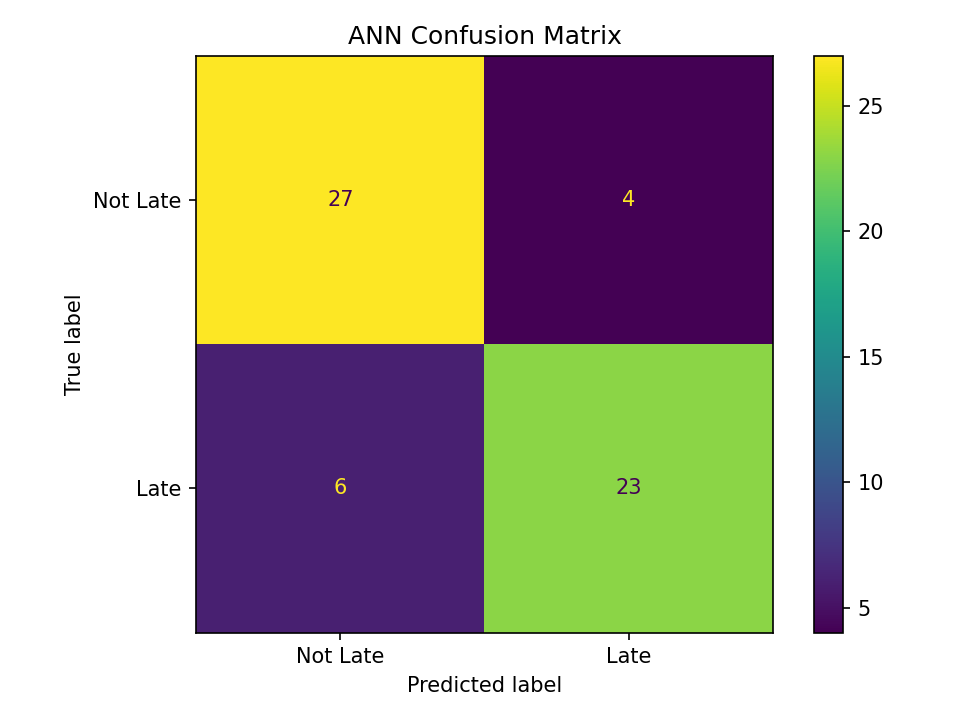

# Machine Learning Practical Project — Late Prediction

## 🎥 Video Submission

**Video Submission Link:**  
🔗 `PASTE_YOUR_VIDEO_SUBMISSION_LINK_HERE`

> Replace the placeholder above with your Google Drive / YouTube / OneDrive / other submission link. Make sure the link has the required viewing access.


A complete machine-learning practical project covering **statistics, data preprocessing, feature engineering, supervised learning, K-Means clustering, and an Artificial Neural Network (ANN)**.

The project predicts whether a record is **Late** or **Not Late** using operational features such as distance, load, traffic, staff, and group.

---

## 📌 Project Overview

This project follows an end-to-end machine learning workflow:

1. Generate and inspect the dataset
2. Remove exact duplicate rows
3. Split data into fit, validation, and test sets
4. Perform descriptive statistics and hypothesis testing
5. Engineer and preprocess features
6. Train a Logistic Regression classifier
7. Evaluate the classifier with classification metrics and a confusion matrix
8. Apply K-Means clustering and compare different values of `k`
9. Build and train an ANN
10. Compare Logistic Regression and ANN performance
11. Save predictions, statistics, clustering results, figures, and the trained ANN model

---

## 🗂️ Dataset

The notebook generates a synthetic dataset with **300 unique records** and the following columns:

| Column | Description |
|---|---|
| `record_id` | Unique record identifier |
| `distance` | Distance-related numerical feature |
| `load` | Load-related numerical feature |
| `traffic` | Traffic-related numerical feature |
| `staff` | Staff-related numerical feature |
| `group` | Categorical group: `G1` or `G2` |
| `late` | Target variable: `0 = Not Late`, `1 = Late` |

Two numerical columns contain missing values, and five exact duplicate rows are intentionally added during dataset generation.

After duplicate removal:

- **Original rows:** 305
- **Clean rows:** 300
- **Fit set:** 192
- **Validation set:** 48
- **Test set:** 60

The split uses stratification and `random_state=42`.

---

# 1. 📊 Statistics & Exploratory Analysis

## Distance Descriptive Statistics

The distance variable was analyzed on the fit data.

| Statistic | Value |
|---|---:|
| Observed `n` | 184 |
| Mean | 49.7444 |
| Median | 50.2000 |
| Sample Standard Deviation | 10.8359 |

### Distance Distribution



The histogram shows the distribution of the `distance` feature used in the statistical analysis.

---

## Welch Two-Sided t-Test

The project compares the mean distance between groups `G1` and `G2`.

- **H₀:** Mean distance of G1 = Mean distance of G2
- **H₁:** Mean distance of G1 ≠ Mean distance of G2
- **Significance level:** α = 0.05

| Statistic | Value |
|---|---:|
| t-statistic | 0.706161 |
| p-value | 0.481059 |

Based on the recorded p-value, the notebook's decision is **fail to reject H₀ at α = 0.05**.

---

## 95% Confidence Interval

The 95% confidence interval for the mean distance is:

**[48.1683, 51.3205]**

---

## Covariance & Principal Direction

The covariance analysis was performed for `distance` and `traffic`.

- **Largest eigenvalue:** 117.566997
- **Variance share explained by the largest eigenvalue:** 52.29%

---

# 2. 🧹 Data Preprocessing & Feature Engineering

### Numeric Features

```text
distance
load
traffic
staff
```

### Categorical Feature

```text
group
```

### Preprocessing Steps

- Median imputation for missing numerical values
- Imputation fitted **only on the fit set**
- One-hot encoding of `group`
- StandardScaler applied to numerical features
- Same fitted transformations applied to validation and test data

### Engineered Feature

A new feature was created:

```text
engineered_feature = load / (staff + 1)
```

### Final Features

```text
distance
load
traffic
staff
engineered_feature
group_G1
group_G2
```

Therefore, the final model input contains **7 features**.

---

# 3. 🤖 Supervised Learning — Logistic Regression

A majority-class `DummyClassifier` was used as the baseline.

The main classifier is:

```python
LogisticRegression(
    max_iter=1000,
    random_state=42
)
```

## Logistic Regression Performance

| Metric | Score |
|---|---:|
| Accuracy | 0.8500 |
| Precision | 0.8846 |
| Recall | 0.7931 |
| F1 Score | 0.8364 |

### Confusion Matrix




The matrix contains:

- **28** correctly predicted `Not Late`
- **3** `Not Late` records predicted as `Late`
- **6** `Late` records predicted as `Not Late`
- **23** correctly predicted `Late`

---

# 4. 🔵 K-Means Clustering

K-Means clustering was applied to the scaled numerical feature data.

The project tested:

```text
k = 2
k = 3
k = 4
```

## K-Means Scores

| k | Inertia | Silhouette |
|---:|---:|---:|
| 2 | 719.6321 | 0.246337 |
| 3 | 599.6594 | 0.207147 |
| 4 | 535.3835 | 0.190232 |

The notebook selects the value with the highest silhouette score.

**Selected k: 2**

## Cluster Profiles

| Cluster | Distance | Load | Traffic | Staff | Engineered Feature |
|---:|---:|---:|---:|---:|---:|
| 0 | 48.4190 | 47.1280 | 49.0663 | 54.0350 | 0.8633 |\n| 1 | 52.8695 | 57.4616 | 49.8562 | 41.4267 | 1.3730 |\n
---

# 5. 🧠 Artificial Neural Network

The ANN architecture used in the notebook is:

```text
Input: 7 features
        ↓
Dense(16, ReLU)
        ↓
Dense(8, ReLU)
        ↓
Dense(1, Sigmoid)
```

### Training Configuration

- Optimizer: **Adam**
- Learning rate: **0.001**
- Loss: **Binary Cross-Entropy**
- Batch size: **16**
- Maximum epochs: **50**
- Early stopping: enabled
- Monitored metric: `val_loss`
- Patience: **5**
- Restore best weights: **True**
- Random seed: **42**

The network contains **153 trainable parameters**.

---

## ANN Training & Validation Loss



The training loss decreases throughout training, while validation loss decreases and then levels off. The use of early stopping helps prevent unnecessary training after validation performance stops improving.

---

## ANN Confusion Matrix




The matrix contains:

- **27** correctly predicted `Not Late`
- **4** `Not Late` records predicted as `Late`
- **6** `Late` records predicted as `Not Late`
- **23** correctly predicted `Late`

---

## ANN Performance

| Metric | Score |
|---|---:|
| Accuracy | 0.8333 |
| Precision | 0.8519 |
| Recall | 0.7931 |
| F1 Score | 0.8214 |

---

# 6. 📈 Model Comparison

| Model | Accuracy | Precision | Recall | F1 |
|---|---:|---:|---:|---:|
| Dummy Classifier | 0.5167 | — | — | — |
| Logistic Regression | 0.8500 | 0.8846 | 0.7931 | 0.8364 |
| ANN | 0.8333 | 0.8519 | 0.7931 | 0.8214 |

For this recorded test set, Logistic Regression has accuracy **0.8500** and F1 **0.8364**, while the ANN has accuracy **0.8333** and F1 **0.8214**. Both models have a recall of **0.7931**.

These values describe this particular held-out test set and should not be interpreted as a guarantee of performance on new datasets.

---

# 7. 📁 Complete Project / Group Structure

The complete submission can be organized as follows:

```text
Machine-Learning-Late-Prediction/
│
├── 📓 Exam(2).ipynb
├── 📄 README.md
│
├── 📂 data/
│   └── 📂 raw/
│       └── set_b.csv
│
├── 📂 outputs/
│   ├── splits.csv
│   ├── preprocessing_features.csv
│   ├── logistic_predictions.csv
│   ├── kmeans_scores.csv
│   ├── cluster_profiles.csv
│   ├── cluster_assignments.csv
│   ├── ann_predictions.csv
│   ├── model_comparison.csv
│   ├── statistics_summary.csv
│   │
│   └── 📂 figures/
│       ├── distance_histogram.png
│       ├── logistic_confusion_matrix.png
│       ├── ann_loss_curve.png
│       └── ann_confusion_matrix.png
│
├── 📂 models/
│   └── ann_model.keras
│
└── 📂 images/
    ├── distance_histogram.png
    ├── logistic_confusion_matrix.png
    ├── ann_loss_curve.png
    └── ann_confusion_matrix.png
```

### 📌 Module / Task Structure

```text
PROJECT
│
├── 1. DATASET & DATA SPLITTING
│   ├── Create required folders
│   ├── Generate supplied dataset
│   ├── Load and inspect data
│   ├── Remove exact duplicates
│   ├── Separate features and target
│   ├── Train / validation / test split
│   ├── Save split IDs
│   └── Check partition overlap
│
├── 2. MODULE 1 — MATHS & ADVANCED STATISTICS
│   ├── Distance descriptive statistics
│   ├── Welch two-sided t-test
│   ├── 95% confidence interval
│   ├── Covariance matrix
│   ├── Eigenvalues
│   └── Principal direction
│
├── 3. TASK 2 — DATA PREPROCESSING & FEATURE ENGINEERING
│   ├── F1 — Audit and Partition
│   ├── F2 — Transform and Engineer
│   ├── F3 — Leakage Evidence
│   ├── Numeric / categorical columns
│   ├── Median imputation
│   ├── Engineered feature
│   ├── One-hot encoding
│   ├── Standardization
│   └── Final transformed features
│
├── 4. TASK 3 — SUPERVISED LEARNING
│   ├── S1 — Baseline and Classifier
│   ├── S2 — Holdout Evaluation
│   ├── S3 — Interpretation
│   ├── Majority-class baseline
│   ├── Logistic Regression
│   ├── Classification metrics
│   ├── Confusion matrix
│   └── Test predictions
│
├── 5. TASK 4 — UNSUPERVISED LEARNING
│   ├── U1 — K-Means and Selection
│   ├── U2 — Segment Interpretation
│   ├── Test k = 2, 3, 4
│   ├── Silhouette score
│   ├── Final K-Means
│   ├── Cluster profiles
│   └── Cluster results
│
└── 6. TASK 5 — DEEP LEARNING / ANN
    ├── D1 — ANN Architecture and Compilation
    ├── D2 — Training and Validation
    ├── D3 — Comparison and Evidence
    ├── TensorFlow / Keras
    ├── 16 ReLU → 8 ReLU → 1 Sigmoid
    ├── Trainable parameter count
    ├── Early stopping
    ├── ANN training
    ├── Loss curve
    ├── ANN test prediction
    ├── ANN metrics
    ├── ANN confusion matrix
    ├── Model comparison
    └── Saved ANN model
```

---

# 8. 📁 Project Structure

```text
Project/
│
├── data/
│   └── raw/
│       └── set_b.csv
│
├── outputs/
│   ├── splits.csv
│   ├── preprocessing_features.csv
│   ├── logistic_predictions.csv
│   ├── kmeans_scores.csv
│   ├── cluster_profiles.csv
│   ├── cluster_assignments.csv
│   ├── ann_predictions.csv
│   ├── model_comparison.csv
│   ├── statistics_summary.csv
│   │
│   └── figures/
│       ├── distance_histogram.png
│       ├── logistic_confusion_matrix.png
│       ├── ann_loss_curve.png
│       └── ann_confusion_matrix.png
│
├── models/
│   └── ann_model.keras
│
├── Exam(2).ipynb
└── README.md
```

---

# 9. 💾 Saved Outputs

The notebook saves:

### Data & preprocessing
- `splits.csv`
- `preprocessing_features.csv`

### Supervised learning
- `logistic_predictions.csv`
- `ann_predictions.csv`
- `model_comparison.csv`

### Unsupervised learning
- `kmeans_scores.csv`
- `cluster_profiles.csv`
- `cluster_assignments.csv`

### Statistics
- `statistics_summary.csv`

### Figures
- `distance_histogram.png`
- `logistic_confusion_matrix.png`
- `ann_loss_curve.png`
- `ann_confusion_matrix.png`

### Model
- `ann_model.keras`

---

# 10. 🛠️ Technologies Used

- Python
- NumPy
- Pandas
- Matplotlib
- SciPy
- Scikit-learn
- TensorFlow / Keras
- Joblib
- Jupyter Notebook

---

# 11. 🎯 Key Learning Outcomes

This project demonstrates practical understanding of:

- Data generation and inspection
- Duplicate detection and removal
- Train/validation/test splitting
- Missing-value imputation
- One-hot encoding
- Feature engineering
- Feature scaling
- Data leakage prevention
- Descriptive statistics
- Welch's t-test
- Confidence intervals
- Covariance matrices
- Eigenvalues and principal directions
- Logistic Regression
- Classification metrics
- Confusion matrices
- K-Means clustering
- Inertia and silhouette score
- Cluster profiling
- Artificial Neural Networks
- ReLU and Sigmoid activation functions
- Binary cross-entropy
- Adam optimizer
- Early stopping
- Model comparison
- Saving predictions and trained models

---

## 12. 👨‍💻 Project Workflow

```text
Raw Data
   ↓
Duplicate Removal
   ↓
Train / Validation / Test Split
   ↓
Statistical Analysis
   ↓
Missing Value Imputation
   ↓
Feature Engineering
   ↓
One-Hot Encoding
   ↓
Standardization
   ↓
 ┌───────────────────────┐
 │                       │
 ↓                       ↓
Logistic Regression   K-Means
 │                       │
 ↓                       ↓
Evaluation            Clustering
 │
 ↓
ANN
 │
 ↓
Model Comparison
```

---

## 14. 📌 Reproducibility

The notebook uses:

```python
SEED = 42
RANDOM_STATE = 42
```

and sets random seeds for NumPy, Python's `random`, TensorFlow, and the K-Means/Logistic Regression workflows where applicable.

---

## 13. 📄 Main Notebook

The complete implementation is available in:

```text
Exam(2).ipynb
```

