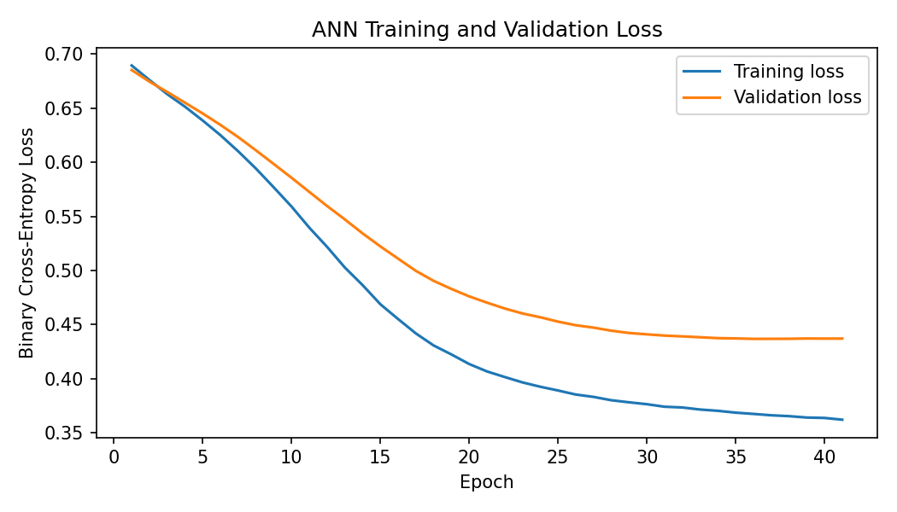
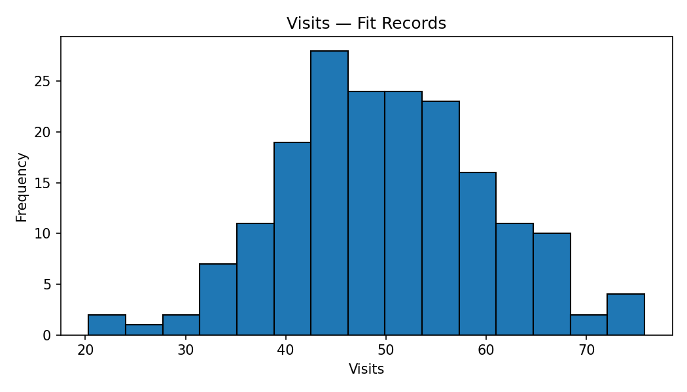
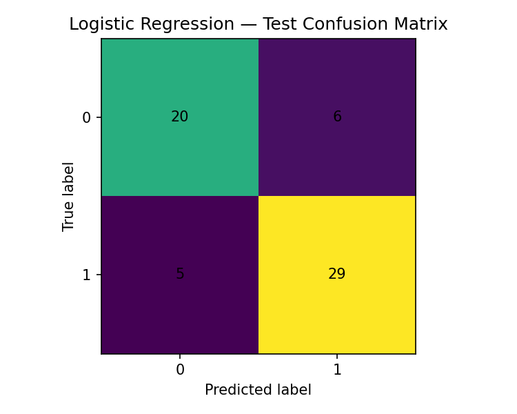

# Data Science & AI/ML Practical Exam — Set A

## Predict Campaign Responses and Identify Audience Segments

This project demonstrates a complete **Data Science and AI/ML workflow** using a synthetic campaign-response dataset. It covers data cleaning, statistical analysis, feature engineering, supervised learning, clustering, and deep learning with an Artificial Neural Network (ANN).

> **Note:** The notebook contains some task wording that refers to the target as *default* in one cell and *defect* in later cells. The implemented target column is `response`, where `1` represents the positive/target class and `0` represents the negative class.

---

## 🎥 Project Video

Watch the complete project demonstration:

**[▶️ Watch Project Video](YOUR_VIDEO_LINK_HERE)**

> Replace `YOUR_VIDEO_LINK_HERE` with your YouTube, Google Drive, or other video URL.

## 📌 Project Overview

The workflow includes:

- Data generation and loading
- Data quality auditing
- Duplicate removal
- Missing-value analysis
- Train/validation/test partitioning
- Descriptive statistics
- Welch's t-test
- 95% confidence interval
- Covariance matrix and eigenvalue analysis
- Feature engineering
- Median imputation
- Standardization
- One-hot encoding
- Leakage checks
- Logistic Regression
- DummyClassifier baseline
- Confusion matrix analysis
- K-Means clustering
- Silhouette-based cluster selection
- PyTorch ANN
- Early stopping
- Model comparison
- Saved prediction and model artifacts

---

## 🗂️ Dataset

The dataset contains **300 unique records** after removing exact duplicate rows.

### Main features

| Feature | Description |
|---|---|
| `record_id` | Unique record identifier |
| `visits` | Number of visits |
| `recency` | Recency-related numeric feature |
| `engagement` | Engagement measure |
| `spend` | Spending measure |
| `group` | Categorical group (`G1`, `G2`) |
| `response` | Binary target variable |

An engineered feature is also created:

```text
engineered_feature = engagement / (recency + 1)
```

---

## 🔄 Data Preparation

The raw dataset initially contains:

- **305 rows**
- Exact duplicate records
- Missing values in `visits` and `recency`

After duplicate removal:

- **300 unique records**

The data is split into:

| Partition | Records |
|---|---:|
| Fit / Training | 192 |
| Validation | 48 |
| Test | 60 |

The partitions are kept disjoint, and preprocessing is fitted only on the fit data before being applied to validation and test data.

---

## 🖼️ Project Screenshots

### ANN Training & Validation Loss


### Visits Distribution


### Logistic Regression — Test Confusion Matrix


## 📊 Statistical Analysis

### Descriptive Statistics

The project calculates:

- Number of observed values
- Mean
- Median
- Sample standard deviation

### Visits Distribution


### Statistical Inference

A **Welch's independent two-sample t-test** is used to compare `visits` between groups `G1` and `G2`.

A **95% confidence interval** is also calculated for the overall observed mean visits.

### Linear Algebra

For `visits` and `engagement`, the notebook calculates:

- Sample covariance matrix
- Eigenvalues
- Eigenvectors
- Variance share of the largest eigenvalue
- Principal direction

---

## 🛠️ Feature Engineering & Preprocessing

The preprocessing pipeline includes:

### Numerical Features

- Median imputation
- Engineered feature creation
- StandardScaler

### Categorical Feature

- One-hot encoding of `group`
- `handle_unknown="ignore"`

Final transformed features:

```text
visits
recency
engagement
spend
engineered_feature
group_G1
group_G2
```

Total transformed feature count:

**7**

The notebook explicitly excludes `record_id`, the target, and test-set statistics from model training to reduce data leakage risk.

---

## 🤖 Supervised Learning

Two baseline/classification approaches are evaluated:

1. `DummyClassifier`
2. `LogisticRegression`

### Test-set Results

| Model | Accuracy | Precision | Recall | F1 |
|---|---:|---:|---:|---:|
| DummyClassifier | 0.567 | 0.567 | 1.000 | 0.723 |
| Logistic Regression | 0.817 | 0.829 | 0.853 | 0.841 |

The metrics are calculated on the same **60 untouched test records**.

### Logistic Regression Confusion Matrix


The confusion matrix contains:

```text
[[20, 6],
 [ 5, 29]]
```

This corresponds to:

- True Negatives: 20
- False Positives: 6
- False Negatives: 5
- True Positives: 29

---

## 🔵 Unsupervised Learning — K-Means

K-Means clustering is tested with:

- `k = 2`
- `k = 3`
- `k = 4`

Silhouette scores from the notebook:

| k | Inertia | Silhouette |
|---:|---:|---:|
| 2 | 958.390 | 0.301 |
| 3 | 803.810 | 0.251 |
| 4 | 693.931 | 0.240 |

The notebook selects **k = 2** using the highest silhouette score.

Cluster IDs are descriptive labels only and do not represent target/defect classes.

---

## 🧠 Deep Learning — ANN

The project implements the required ANN architecture using **PyTorch**.

### Architecture

```text
Input: 7 features
       ↓
Dense: 16 neurons
       ↓
ReLU
       ↓
Dense: 8 neurons
       ↓
ReLU
       ↓
Dense: 1 neuron
       ↓
Sigmoid
```

### Training Configuration

- Loss: Binary Cross-Entropy
- Optimizer: Adam
- Learning rate: `0.001`
- Batch size: `16`
- Maximum epochs: `50`
- Validation set: `48 records`
- Early stopping patience: `5`
- Best validation weights restored

Training stopped after:

**41 epochs**

Best validation loss:

**0.4368**

### ANN Training Curve


The training loss continues to decrease while validation loss decreases and then levels off, with early stopping used to restore the best validation state.

---

## 📈 Model Comparison

The final comparison on the same 60 test records is:

| Model | Accuracy | Precision | Recall | F1 |
|---|---:|---:|---:|---:|
| DummyClassifier | 0.567 | 0.567 | 1.000 | 0.723 |
| Logistic Regression | 0.817 | 0.829 | 0.853 | 0.841 |
| ANN | 0.783 | 0.800 | 0.824 | 0.812 |

The notebook notes that model selection should consider the observed test metrics, model simplicity, and the limitation of using a single small holdout test set.

The ANN and Logistic Regression predictions were also reconciled using the same 60 test record IDs.

---

## 📁 Project Structure

```text
.
├── finalprojects.ipynb
├── README.md
│
├── screenshots/
│   ├── ann_loss_curve.png
│   ├── visits_histogram.png
│   └── logistic_confusion_matrix.png
│
└── outputs/
    ├── splits.csv
    ├── statistics_summary.csv
    ├── inference_results.csv
    ├── covariance_matrix.csv
    ├── eigenvalues.csv
    ├── supervised_metrics.csv
    ├── logistic_test_predictions.csv
    ├── k_selection_scores.csv
    ├── cluster_profiles.csv
    ├── ann_loss_history.csv
    ├── model_comparison.csv
    └── ann_test_predictions.csv
```

---

## 💾 Saved Model Evidence

The notebook saves:

- `quality_ann_state_dict.pt`
- `model_comparison.csv`
- `ann_test_predictions.csv`
- `logistic_test_predictions.csv`
- `logistic_confusion_matrix.png`
- `ann_loss_curve.png`
- `ann_loss_history.csv`

A final checklist in the notebook verifies that the required generated evidence files exist.

---

## 🧰 Technologies Used

- Python
- NumPy
- Pandas
- SciPy
- Matplotlib
- Scikit-learn
- PyTorch
- Jupyter Notebook

---

## ▶️ How to Run

### 1. Clone the repository

```bash
git clone <your-repository-url>
cd <your-repository-folder>
```

### 2. Install dependencies

```bash
pip install numpy pandas scipy matplotlib scikit-learn torch jupyter
```

### 3. Open the notebook

```bash
jupyter notebook finalprojects.ipynb
```

### 4. Run all cells

Run the notebook from top to bottom so that the dataset, preprocessing objects, models, plots, and output evidence are generated consistently.

---

## 📌 Key Takeaways

- The dataset is cleaned before modeling by removing exact duplicates.
- Preprocessing is fitted on the fit partition and reused for validation/test data.
- The transformed feature space contains **7 features**.
- Logistic Regression and ANN are evaluated on the same untouched test set.
- K-Means clustering is evaluated using silhouette scores.
- The ANN uses a compact `7 → 16 → 8 → 1` architecture with ReLU and Sigmoid activations.
- Early stopping restores the ANN's best validation state.
- The notebook preserves prediction files and model evidence for reproducibility.

---

## 👨‍💻 Project

**Data Science & AI/ML Practical Exam — Set A**

Focus areas:

`Statistics` • `Data Preprocessing` • `Feature Engineering` • `Machine Learning` • `Clustering` • `Deep Learning` • `Model Evaluation`
